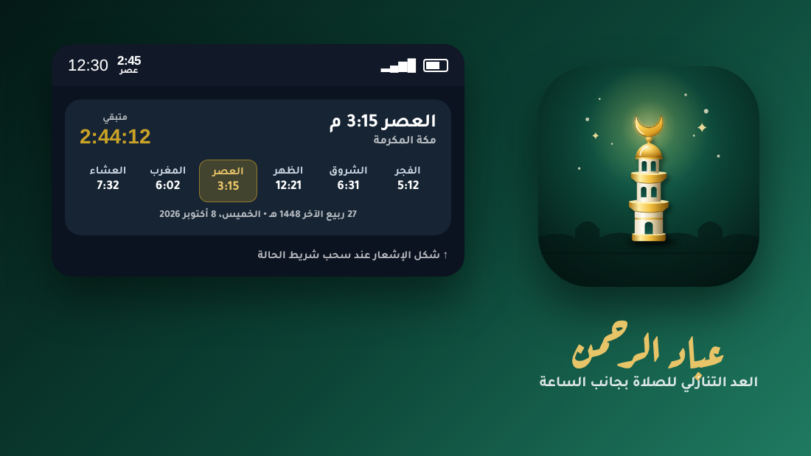

<div dir="rtl">

# عباد الرحمن 🕌🌙


تطبيق أندرويد لمواقيت الصلاة يعرض **الصلاة القادمة والوقت المتبقي في شريط الحالة بجانب الساعة** (تمامًا مثل عدّاد سرعة الإنترنت)، مع أذان من ملف تختاره، وتنبيهات قبل الصلاة، وودجت بعدة أشكال وشفافية قابلة للتعديل.

> ﴿وَعِبَادُ الرَّحْمَٰنِ الَّذِينَ يَمْشُونَ عَلَى الْأَرْضِ هَوْنًا﴾ — الفرقان: ٦٣

<p align="center"></p>
<p align="center"><sub>تصور توضيحي للعداد بجانب الساعة والإشعار الموسّع والأيقونة</sub></p>

## المزايا

### ⏱️ شريط الحالة (بجانب الساعة)
- أيقونة نصية حيّة تُرسم كل دقيقة تعرض الوقت المتبقي للصلاة القادمة واسمها، مثل `1:23` فوق `عصر`.
- أربعة أشكال للعرض: المتبقي + الاسم، المتبقي فقط، وقت الصلاة + الاسم، وقت الصلاة فقط.
- عند سحب الإشعارات: عدّاد تنازلي حيّ بالثواني وجدول بجميع أوقات اليوم مع إبراز الصلاة القادمة.
- مربع في الإعدادات السريعة (Quick Settings) يعرض الصلاة القادمة.

### 📍 الموقع والمنطقة
- **تلقائي** عبر GPS أو الشبكة (دون خدمات Google)، ويتحدّث عند السفر.
- **يدوي** من قائمة مدمجة تضم نحو ٣٠٠ مدينة (كل الدول العربية والإسلامية والجاليات) مع بحث ذكي بالعربية.
- إدخال الإحداثيات يدويًا واختيار المنطقة الزمنية.

### 🧮 الحساب والتعديل اليدوي
- حساب فلكي دقيق **يعمل دون إنترنت**، تمت مطابقته مع مكتبة adhan المرجعية (أكثر من ٩٤ ألف مقارنة: ٩٦٪ مطابق تمامًا و٩٩٫٨٪ بفارق دقيقة كحد أقصى).
- ٢٢ طريقة حساب: أم القرى، رابطة العالم الإسلامي، الهيئة المصرية، كراتشي، أمريكا الشمالية، دبي، الكويت، قطر، الخليج، الأردن، الجزائر، المغرب، تونس، تركيا، سنغافورة، ماليزيا، إندونيسيا، فرنسا، روسيا، طهران، الجعفري، ومخصص.
- اختيار تلقائي للطريقة حسب الدولة، والعصر (الجمهور/الحنفي)، وقواعد خطوط العرض العليا.
- **تقديم أو تأخير كل صلاة بالدقائق** ليتطابق مع مسجدك أو التقويم الرسمي.
- رمضان في أم القرى: العشاء بعد المغرب بساعتين تلقائيًا، وتعديل التاريخ الهجري ±٢ يوم.

### 🔊 الأذان والتنبيهات
- **اختيار ملف الأذان من الهاتف**، مع أذان مستقل لصلاة الفجر، وتجربة الصوت والتحكم بمستواه.
- لكل صلاة: أذان كامل / إشعار بصوت تنبيه / بدون تنبيه.
- **التذكير قبل الصلاة بالمدة التي تختارها** (٥، ١٠، ١٥… أو أي عدد دقائق) ولأي صلاة.
- تنبيه الإقامة بمدة مستقلة لكل صلاة.
- إيقاف الأذان بزر القفل، والتشغيل حتى في الوضع الصامت، والاهتزاز، ودعاء ما بعد الأذان.
- تحويل الهاتف إلى الاهتزاز أثناء الصلاة ثم إعادة الرنين تلقائيًا.
- تذكير سورة الكهف صباح الجمعة، وتسمية الظهر «الجمعة» يوم الجمعة.
- منبّهات دقيقة تعمل بعد إعادة التشغيل وتغيير الوقت أو المنطقة الزمنية.

### 🧩 الودجت (خمسة أشكال + الشفافية)
| الشكل | الوصف |
|---|---|
| الصلاة القادمة (2×2) | الاسم والوقت وعدّاد تنازلي حيّ والتاريخ الهجري |
| مواقيت اليوم (4×2) | المدينة والتاريخ وجميع الأوقات مع إبراز القادمة |
| الحلقة (2×2) | حلقة تقدّم دائرية بين الصلاتين |
| الشريط (4×1) | شريط نحيف بجميع الأوقات |
| الساعة (4×2) | ساعة كبيرة مع التاريخين والصلاة القادمة |

لكل ودجت: خمس سمات لونية (ليلي، زمردي، ذهبي، زجاجي، فاتح) وشريط لضبط **الشفافية من ٠ إلى ١٠٠٪** مع معاينة فوق خلفية.

### ✨ إضافات
- بوصلة القبلة مع تصحيح الانحراف المغناطيسي واهتزاز عند الاتجاه الصحيح، والمسافة إلى مكة.
- تقويم شهري كامل بالتاريخين الهجري والميلادي.
- مسبحة إلكترونية بالأذكار والأهداف (٣٣، ٩٩، ١٠٠، بلا حد).
- الإمساك، ومنتصف الليل، والثلث الأخير من الليل.
- سمة فاتحة/داكنة، أرقام عربية مشرقية أو لاتينية، ونظام ١٢/٢٤ ساعة.
- واجهة عربية بالكامل من اليمين لليسار بخطَّي Tajawal و Aref Ruqaa.

### 🎨 الأيقونة
أيقونة ثلاثية الأبعاد: مئذنة من الحجر العاجي بشرفات ذهبية، يعلوها **هلال ذهبي متوهّج** في سماء ليلية زمردية، مع طبقة أحادية اللون لأيقونات أندرويد 13 المتناسقة. المصدر في مجلد `art/`.

## التثبيت

### تنزيل ملف APK جاهز
كل دفع إلى المستودع يبني التطبيق تلقائيًا عبر GitHub Actions:
1. افتح تبويب **Actions** ← **Ibad Al-Rahman APK** ← آخر تشغيل ناجح.
2. نزّل **IbadAlRahman-apk** وفُكّ الضغط.
3. ثبّت `app-release.apk` (أصغر حجمًا) أو `app-debug.apk`.

### البناء محليًا
يحتاج JDK 17 أو أحدث و Android SDK:
```bash
cd IbadAlRahman
./gradlew assembleRelease      # app/build/outputs/apk/release/app-release.apk
./gradlew testDebugUnitTest    # اختبارات محرك المواقيت
```
> نسخة release موقّعة بمفتاح التصحيح ليسهل تثبيتها؛ استخدم مفتاحك الخاص قبل النشر على Google Play.

## بعد التثبيت (مهم لدقة الأذان)
1. اسمح **بالإشعارات** (للأذان والعداد بجانب الساعة).
2. فعّل **المنبهات والتذكيرات** ليُرفع الأذان في وقته بالضبط.
3. استثنِ التطبيق من **توفير البطارية** (وفي شاومي/هواوي فعّل التشغيل التلقائي).
4. من الإعدادات ← الأذان والتنبيهات اختر **ملف الأذان** المفضّل لديك.

جميع هذه الخطوات متاحة من داخل التطبيق: الإعدادات ← «ضمان عمل الأذان».

## البنية التقنية
| المجلد | المحتوى |
|---|---|
| `core/` | محرك الحساب الفلكي (Kotlin خالص، مع اختبارات) والهجري والقبلة |
| `data/` | الإعدادات، قاعدة المدن، تحديد الموقع، مستودع المواقيت |
| `alarm/` | جدولة المنبهات الدقيقة، خدمة الأذان، الإشعارات، وضع الاهتزاز |
| `statusbar/` | خدمة العداد في شريط الحالة ورسم الأيقونة النصية ومربع الإعدادات السريعة |
| `widget/` | الودجت الخمسة وشاشة تخصيصها |
| `ui/` | واجهة Jetpack Compose (الرئيسية، القبلة، الشهر، المسبحة، الإعدادات) |

- Kotlin و Jetpack Compose (Material 3)، أدنى إصدار أندرويد 8.0 (API 26)، ويستهدف أندرويد 16.
- لا إعلانات ولا تتبّع ولا اتصال بالإنترنت؛ كل الحسابات على جهازك.

## الرخص
- الخطوط Tajawal و Aref Ruqaa برخصة SIL Open Font License (انظر `licenses/`).
- النغمات الافتراضية مُولَّدة خصيصًا للتطبيق.

</div>
